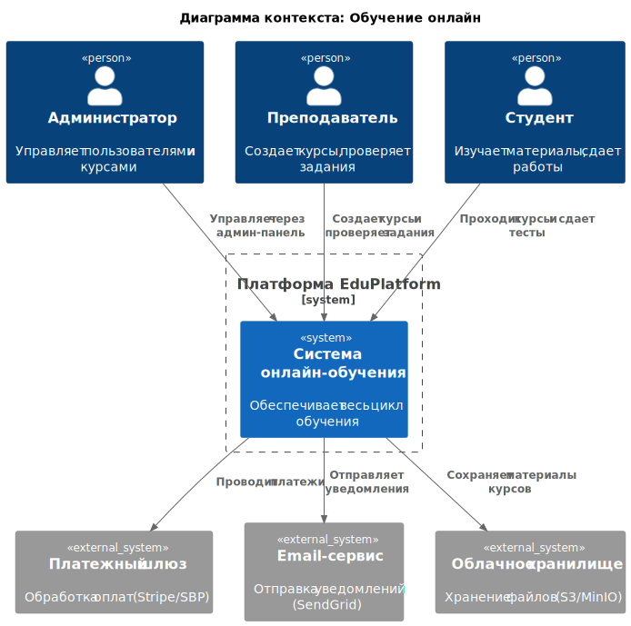
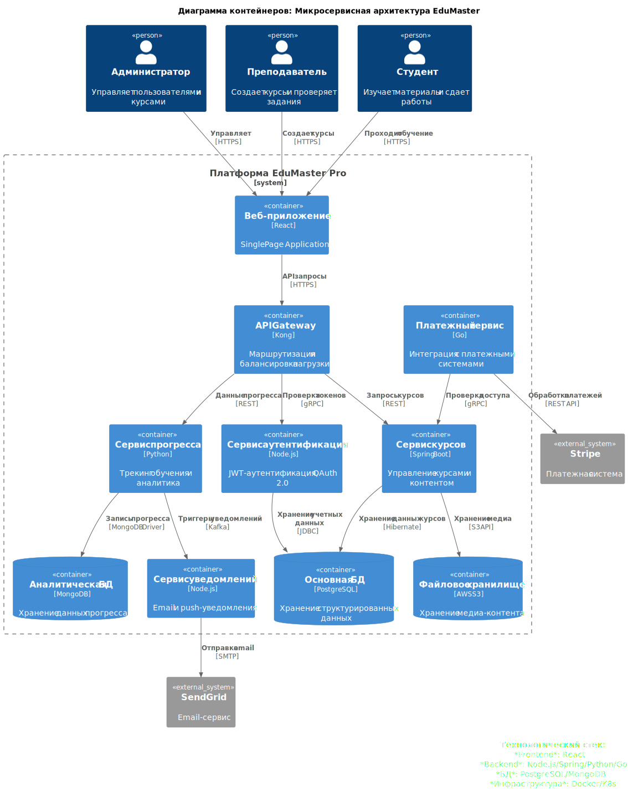

= Ключевые компоненты архитектуры

== Микросервисы

[cols="1,1,2", options="header"]
|===
| Сервис         | Технологии         | Описание
| API Gateway    | Nginx/Kong         | Единая точка входа, маршрутизация
| Auth Service   | Node.js + JWT      | Аутентификация и авторизация
| Course Service | Java/Spring Boot   | Управление курсами и контентом
| Progress Service | Python/Django    | Трекинг прогресса студентов
| Payment Service | Go                | Интеграция с платежными системами
| Notification   | Node.js            | Email/SMS-уведомления
|===

== Нефункциональные требования

=== Производительность
* NFR-01: Загрузка страницы < 3 секунд
* NFR-02: Работа при 1000 одновременных пользователей

=== Безопасность
* NFR-03: Хранение паролей в хешированном виде
* NFR-04: Резервное копирование раз в сутки
* NFR-05: Соответствие 152-ФЗ (персональные данные):
 ** Данные хранятся на серверах в РФ
 ** Согласие на обработку при регистрации
 ** Шифрование передаваемых данных

=== Удобство использования
* NFR-06: Поддержка мобильных устройств
* NFR-07: Интерфейс на русском языке

== Базы данных

* *PostgreSQL* - Основные данные (пользователи, курсы)
* *MongoDB* - Аналитика прогресса и ленты событий
* *Redis* - Кэширование и сессии

== Внешние сервисы

* *Платежи*: Stripe, СБП, Qiwi
* *Хранение файлов*: AWS S3 или MinIO
* *Уведомления*: 
  ** Email: SendGrid
  ** SMS: Twilio

== Принципы взаимодействия

=== Frontend

* SPA на React с защищенными роутами
* Общение с бэкендом через API Gateway

=== Backend

* Микросервисы общаются через:
  ** HTTP/REST _или_
  ** RabbitMQ (для асинхронного взаимодействия)
* Синхронные запросы для критичных данных (например, оплата)
* Асинхронные события для нотификаций

=== Безопасность

* Все сервисы расположены за API Gateway с JWT-валидацией
* Разделение БД для изоляции данных

== Диаграмма контекста (Context Diagram)

== Диаграмма контейнеров (Container Diagram)

