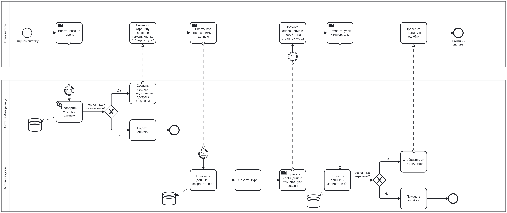

== Бизнес-процессы

=== Проверка заданий (для преподавателей и студентов)

==== Потребности:
* Преподаватели: минимизация рутинной работы

* Студенты: прозрачность и скорость оценки

Процесс:

1. *Студент* отправляет работу → система фиксирует время сдачи  
2. Для тестов:  
   - Автоматическая проверка (мгновенно)  
   - Разбор ошибок с подсказками  
3. Для эссе/проектов:  
   - Преподаватель получает уведомление  
   - Использует инструменты аннотации:  
     • Текстовые комментарии на полях  
     • Голосовые пояснения (до 3 мин)  
4. *Студент* видит оценку + обратную связь в ЛК  

==== Оплата курсов (для студентов и администраторов)
* Безопасность транзакций

* Гибкие условия оплаты

Процесс:

[cols="1,2", options="header"]
|===
| Вариант | Реализация  
| Разовый платеж 
| - Страница оплаты с выбором:  
  • Банковская карта (3D-Secure)  
  • СБП (по QR-коду)  
  • Криптовалюта (USDT)  

| Рассрочка 
| - Интеграция с Тинькофф/СберБанком  
- Автоматический пересчет стоимости  

| Корпоративный доступ 
| - Выставление счетов юр.лицам  
- API для интеграции с 1С  
|===

=== Процесс создания курса

==== Потребность:
Преподавателям требуется простой инструмент для структурирования учебного контента без технических сложностей.

Процесс:
[cols="1,3", options="header"]

|===
| Шаг | Действия и пользовательские сценарии
| 1. Инициализация 
| *Преподаватель:*  
- Выбирает "Создать курс" в ЛК  
- Вводит базовую информацию:  
  • Название (макс. 100 символов)  
  • Краткое описание (для каталога)  
  • Язык курса  

| 2. Структурирование 
| *Система:*  
- Предлагает шаблоны:  
  • Линейный (модули → уроки)  
  • Адаптивный (ветвление по уровню)  
*Преподаватель:*  
- Добавляет модули (например: "Основы Python")  
- Внутри модуля создает уроки (минимум 3)  

| 3. Загрузка контента 
| *Поддерживаемые форматы:*  
- Видео (MP4, до 1080p)  
- Документы (PDF/PPTX с OCR)  
- Интерактивные элементы (SCORM)  
*Особенности:*  
- Автоматическая конвертация в адаптивные форматы  
- Проверка на плагиат (интеграция с Unicheck)  

| 4. Настройка доступа 
| *Варианты:*  
- Открытый (для всех)  
- По коду доступа (для групп)  
- Платный (интеграция с PayPal/СБП)  
*Дополнительно:*  
- Возможность пробного доступа (20% материалов)  

| 5. Публикация 
| *Модерация:*  
- Автопроверка на запрещенный контент  
- Ручное утверждение администратором (до 24 ч)  
|===

