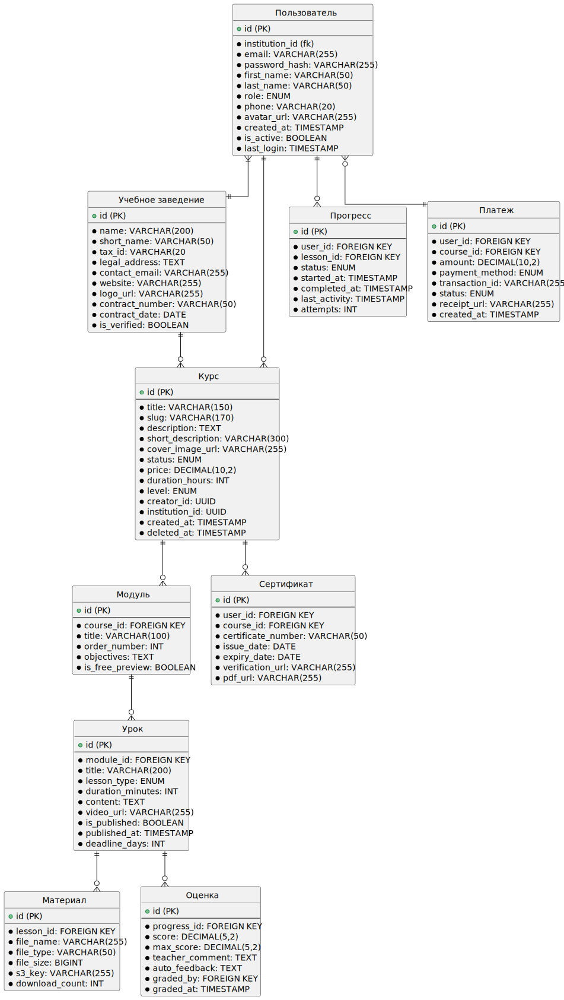

== Схема БД

== Описание БД

[cols="1,3", options="header"]
|===
| Название сущности | Описание

| *Пользователь (User)*
| Основной аккаунт в системе. Хранит данные студентов, преподавателей и администраторов.
Включает аутентификационные данные и ролевую модель.

| *Учебное заведение (Institution)*
| Организации, создающие курсы. Содержит юридические и контактные данные для договоров
и отчетности.

| *Курс (Course)*
| Базовая единица обучения. Содержит метаданные (описание, стоимость, уровень сложности)
и связь с организацией-автором.

| *Модуль (Module)*
| Тематический раздел курса. Определяет структуру программы через порядковый номер
и цели обучения.

| *Урок (Lesson)*
| Минимальная единица контента. Может быть лекцией, практическим заданием или тестом.
Содержит временные параметры и контент.

| *Материал (Resource)*
| Прикрепленные файлы для уроков (видео, PDF, презентации). Интегрируется с облачным
хранилищем через S3-ключи.

| *Прогресс (Progress)*
| Трекер прохождения уроков. Фиксирует статус (начато/завершено), время активности
и количество попыток.

| *Оценка (Grade)*
| Результаты проверки работ. Содержит баллы, комментарии преподавателя
и автоматическую обратную связь.

| *Платеж (Payment)*
| Финансовые транзакции за курсы. Включает сумму, способ оплаты
и статус обработки.

| *Сертификат (Certificate)*
| Документы об окончании курсов. Содержат уникальный номер,
даты действия и ссылки для верификации.
|===

=== Пользователь (User)

[cols="1,2,3,4", options="header"]
|===
| Атрибут | Тип данных | Ограничения | Описание
| id | UUID | PRIMARY KEY | Уникальный идентификатор
| email | VARCHAR(255) | UNIQUE, NOT NULL | Логин для входа
| password_hash | VARCHAR(255) | NOT NULL | Хеш пароля (bcrypt)
| first_name | VARCHAR(50) | NOT NULL | Имя
| last_name | VARCHAR(50) | NOT NULL | Фамилия
| role | ENUM | 'student','teacher','admin' | Роль в системе
| phone | VARCHAR(20) |  | Контактный телефон
| avatar_url | VARCHAR(255) |  | Ссылка на аватар
| institution_id | UUID | FOREIGN KEY | Привязка к учебному заведению
| created_at | TIMESTAMP | DEFAULT NOW() | Дата регистрации
| is_active | BOOLEAN | DEFAULT TRUE | Флаг активности
| last_login | TIMESTAMP |  | Последний вход
|===

=== Учебное заведение (Institution)

|===
| Атрибут | Тип данных | Ограничения | Описание
| id | UUID | PRIMARY KEY | Уникальный идентификатор
| name | VARCHAR(200) | NOT NULL | Полное название
| short_name | VARCHAR(50) |  | Аббревиатура
| tax_id | VARCHAR(20) | UNIQUE | ИНН
| legal_address | TEXT |  | Юридический адрес
| contact_email | VARCHAR(255) |  | Email для уведомлений
| website | VARCHAR(255) |  | Сайт
| logo_url | VARCHAR(255) |  | Логотип
| contract_number | VARCHAR(50) |  | Номер договора с платформой
| contract_date | DATE |  | Дата подписания
| is_verified | BOOLEAN | DEFAULT FALSE | Подтвержденный аккаунт
|===

===  Курс (Course)

|===
| Атрибут | Тип данных | Ограничения | Описание
| id | UUID | PRIMARY KEY | Уникальный идентификатор
| title | VARCHAR(150) | NOT NULL | Название курса
| slug | VARCHAR(170) | UNIQUE | URL-идентификатор
| description | TEXT |  | Полное описание
| short_description | VARCHAR(300) |  | Краткое описание
| cover_image_url | VARCHAR(255) |  | Обложка курса
| status | ENUM | 'draft','published','archived' | Статус
| price | DECIMAL(10,2) | DEFAULT 0.00 | Стоимость
| duration_hours | INT |  | Продолжительность (часы)
| level | ENUM | 'beginner','intermediate','advanced' | Уровень сложности
| creator_id | UUID | FOREIGN KEY → User | Автор
| institution_id | UUID | FOREIGN KEY → Institution | Организация
| created_at | TIMESTAMP | DEFAULT NOW() | Дата создания
| updated_at | TIMESTAMP |  | Дата последнего обновления
| deleted_at | TIMESTAMP |  | Удаление
|===

=== Модуль (Module)

|===
| Атрибут | Тип данных | Ограничения | Описание
| id | UUID | PRIMARY KEY | Уникальный идентификатор
| course_id | UUID | FOREIGN KEY → Course | Идентификатор курса
| title | VARCHAR(100) | NOT NULL | Заголовок модуля
| order_number | INT |  | Порядковый номер
| objectives | TEXT |  | Цели модуля
| is_free_preview | BOOLEAN | DEFAULT FALSE | Доступен без оплаты
|===

=== Урок (Lesson)

|===
| Атрибут | Тип данных | Ограничения | Описание
| id | UUID | PRIMARY KEY | Уникальный идентификатор
| module_id | UUID | FOREIGN KEY → Module | Идентификатор модуля
| title | VARCHAR(200) | NOT NULL | Заголовок урока
| lesson_type | ENUM | 'lecture','practice','test','assignment' | Тип урока
| duration_minutes | INT |  | Время прохождения
| content | TEXT |  | HTML-контент
| video_url | VARCHAR(255) |  | Ссылка на видео
| is_published | BOOLEAN | DEFAULT FALSE | Флаг публикации
| published_at | TIMESTAMP |  | Дата публикации
| deadline_days | INT |  | Срок выполнения (дни)
|===

=== Материал (Resource)

|===
| Атрибут | Тип данных | Ограничения | Описание
| id | UUID | PRIMARY KEY | Уникальный идентификатор
| lesson_id | UUID | FOREIGN KEY → Lesson | Идентификатор урока
| file_name | VARCHAR(255) | NOT NULL | Название файла
| file_type | VARCHAR(50) |  | MIME-тип
| file_size | BIGINT |  | В байтах
| s3_key | VARCHAR(255) | UNIQUE | Ключ в хранилище
| download_count | INT | DEFAULT 0 | 
|===

=== Прогресс (Progress)

|===
| Атрибут | Тип данных | Ограничения | Описание
| id | UUID | PRIMARY KEY | Уникальный идентификатор
| user_id | UUID | FOREIGN KEY → User | Идентификатор пользователя
| lesson_id | UUID | FOREIGN KEY → Lesson | Идентификатор урока
| status | ENUM | 'not_started','in_progress','completed','failed' | Статус прогресса
| started_at | TIMESTAMP |  | Дата начала прохождения
| completed_at | TIMESTAMP |  | Дата окончания прохождения
| last_activity | TIMESTAMP |  | Дата последней активности
| attempts | INT | DEFAULT 0 | Попытки прохождения
|===

=== Оценка (Grade)

|===
| Атрибут | Тип данных | Ограничения | Описание
| id | UUID | PRIMARY KEY | Уникальный идентификатор
| progress_id | UUID | FOREIGN KEY → Progress | Идентификатор прогресса 
| score | DECIMAL(5,2) | CHECK (0 <= score <= 100) | Полученное количество баллов
| max_score | DECIMAL(5,2) | DEFAULT 100 | Максимальное количество баллов
| teacher_comment | TEXT |  | Комментарий учителя
| auto_feedback | TEXT |  | Автоматическая обратная связь
| graded_by | UUID | FOREIGN KEY → User | Кто оценил
| graded_at | TIMESTAMP | DEFAULT NOW() | Дата становления оценки
|===

=== Платеж (Payment)

|===
| Атрибут | Тип данных | Ограничения | Описание
| id | UUID | PRIMARY KEY | Уникальный идентификатор
| user_id | UUID | FOREIGN KEY → User | Идентификатор пользователя
| course_id | UUID | FOREIGN KEY → Course | Идентифифкатор курса
| amount | DECIMAL(10,2) | NOT NULL | Стоимость курса
| payment_method | ENUM | 'card','sbp','qiwi' | Метод оплаты
| transaction_id | VARCHAR(255) | UNIQUE | ID в платежной системе
| status | ENUM | 'pending','completed','refunded','failed' | Статус оплаты
| receipt_url | VARCHAR(255) |  | Ссылка на чек
| created_at | TIMESTAMP | DEFAULT NOW() | Дата проведения оплаты
|===

=== Сертификат (Certificate)

|===
| Атрибут | Тип данных | Ограничения | Описание
| id | UUID | PRIMARY KEY | Уникальный идентификатор сертификата
| user_id | UUID | FOREIGN KEY → User | Идентификатор пользователя
| course_id | UUID | FOREIGN KEY → Course | Идентификатор курса
| certificate_number | VARCHAR(50) | UNIQUE | Номер сертификата 
| issue_date | DATE | NOT NULL |  Дата получения
| expiry_date | DATE |  | Срок действия
| verification_url | VARCHAR(255) |  | Ссылка для проверки
| pdf_url | VARCHAR(255) |  | Ссылка на PDF
|===